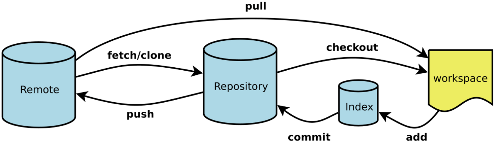
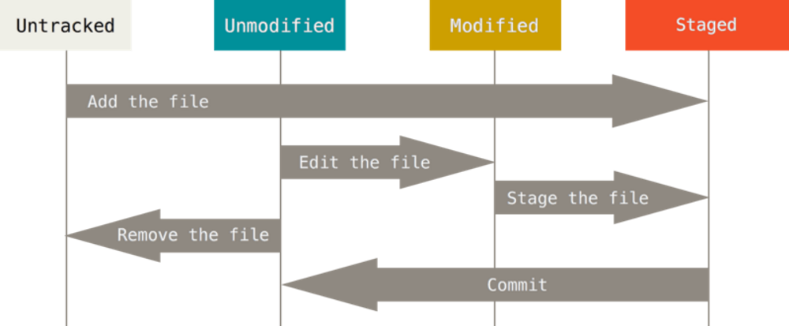
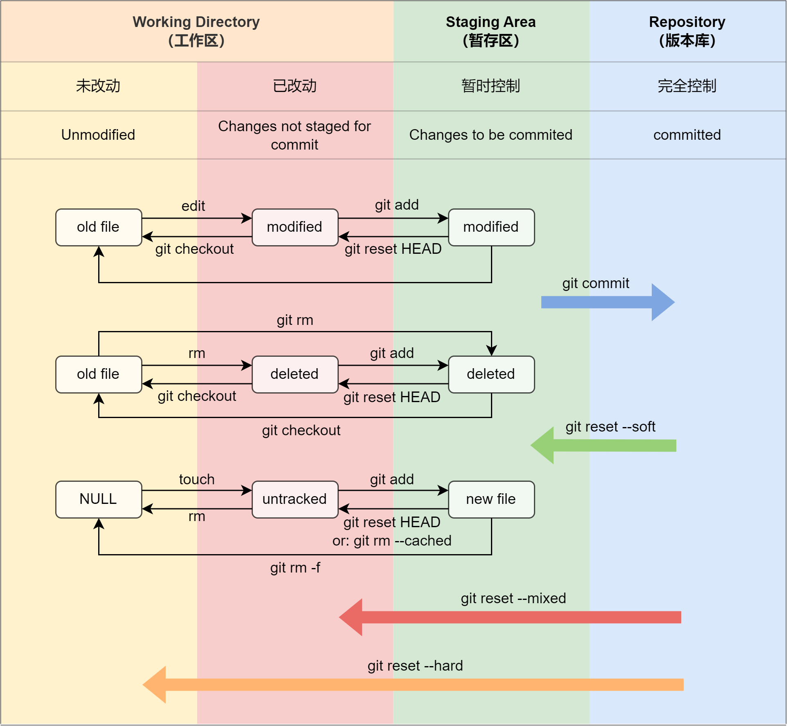

## git 的四个工作区域：

- 工作区（Working Directory）
- 暂存区 (Stage/Index)
- 本地仓库 (Repository 或 Git Directory)
- 远程仓库 (Remote Directory)

## git 仓库中，文件的四种状态：

- untracked ：未跟踪，即虽然在 工作区中，但是没有参与到版本控制。
    - 即："Untracked files"
    - 通过 git add [filename] 转变为 staged。
    - 通过 rm [filename] 将其彻底删除，转变为 unmodified。
- unmodified：文件已经在本地仓库中，且未修改。即工作区与本地仓库的文件版本一致。
    - 即：在 git status 中不显示。
    - 通过 本地修改 转变为 modified
    - 通过 rm  [filename] 转变为 modified。
    - 通过 git rm  [filename] 转变为 staged。（相当于 rm + git add )
- modified：文件已修改，即 git 发现这个文件当前的状态与本地版本库中它的状态不一致了，但仍未对其进行控制。
    - 即： "Changes not staged for commit " 
    - 具体又分为 modified,  deleted 两种状态。
    - 通过 git checkout  [filename] 转变为 unmodified 状态，丢弃此次工作区的修改。
    - 通过 git add  [filename] 转变为 staged 状态，将这次修改进行控制
- Staged：
    - 即： "Changes to be committed " 
    - 具体又分为 new file, modified,  deleted 两种状态。
    - 通过 git commit  [filename] 转变为 unmodified，将暂存区的修改提交本地仓库。
    - 通过 git reset HEAD  [filename] 转变为 modified，将暂存区的修改撤回。（撤销 add 操作，但不影响工作区）
    - 通过 git checkout  [filename] 转变为 unmodified 状态，同时丢弃暂存区和工作区的修改。（撤销 add 操作，并且撤销工作区的修改）

## 状态转移详细图解：

